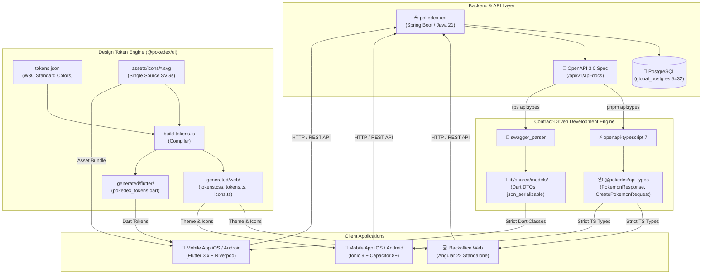

# 🌐 Pokédex System — Enterprise Monorepo

[](https://nx.dev)
[](https://pnpm.io)
[](https://openjdk.org/)
[](https://spring.io/projects/spring-boot)
[](https://angular.dev)
[](https://ionicframework.com/)
[](https://flutter.dev)
[](https://swagger.io/specification/)
[](https://www.docker.com/)
[](https://typicode.github.io/husky/)
[](LICENSE)

Enterprise-grade, multi-application monorepo powered by **Nx** and **pnpm workspaces**, architected around **Java 21 / Spring Boot 4.1.1**, **Angular 22** standalone components with Signal reactivity, **Ionic 9 / Capacitor 8+** for cross-platform hybrid mobile delivery, **Flutter 3.x (Dart 3)** with **RPS (Run Pubspec Scripts)**, **Contract-Driven Development (CDD)** via **OpenAPI 3.0**, **Docker & Docker Compose** orchestration, strict **Git Governance (Husky, Lint-Staged, Commitlint)**, and a **Multiplatform Design Token Engine** (`@pokedex/ui`).

---

## 📑 Table of Contents

- [Core Abstract & Functional Overview](#-core-abstract--functional-overview)
  - [Feature & Workspace Matrix](#feature--workspace-matrix)
- [🚀 Architectural Runtime Flow](#-architectural-runtime-flow)
- [📑 Contract-Driven Development (CDD) with OpenAPI](#-contract-driven-development-cdd-with-openapi)
  - [Single Source of Truth Architecture](#single-source-of-truth-architecture)
  - [TypeScript Contracts (`@pokedex/api-types`)](#typescript-contracts-pokedexapi-types)
  - [Flutter Dart Contracts (`swagger_parser`)](#flutter-dart-contracts-swagger_parser)
  - [Unified Synchronization Workflow](#unified-synchronization-workflow)
- [🛡️ Git Governance, Hooks & Quality Automation](#️-git-governance-hooks--quality-automation)
  - [Husky Git Hooks Architecture](#husky-git-hooks-architecture)
  - [Modular Lint-Staged Matrix](#modular-lint-staged-matrix)
  - [Commitlint & Semantic Versioning](#commitlint--semantic-versioning)
  - [Automated Branch Pruning Utility](#automated-branch-pruning-utility)
- [📁 Directory Tree](#-directory-tree)
- [🛠️ Technical Stack & Dependencies](#️-technical-stack--dependencies)
- [🐳 Docker & Containerization Guide](#-docker--containerization-guide)
- [⚙️ Provisioning & Setup Guide](#️-provisioning--setup-guide)
  - [Prerequisites](#prerequisites)
  - [1. Installation & Hook Setup](#1-repository-installation)
  - [2. Running Applications](#2-running-applications-local-dev)
  - [3. Code Generation & Contract Sincronization](#3-contract-synchronization--design-tokens)
  - [4. Build, Test & Maintenance Scripts](#4-build-test--maintenance-scripts)
- [📈 Performance & Architecture Highlights](#-performance--architecture-highlights)

---

## 📖 Core Abstract & Functional Overview

The **Pokédex System** is an end-to-end digital ecosystem for Pokémon cataloging, administrative management, and multiplatform distribution. Built with a **Single Version Policy (SVP)**, the monorepo guarantees seamless version alignment, eliminates runtime dependency duplication, and enables maximum code and asset sharing across Web, iOS, Android, and Flutter.

### Feature & Workspace Matrix

| Workspace Target | Type | Primary Technology | Description | Status | Documentation Link | Default Port / Target |
| :--- | :--- | :--- | :--- | :--- | :--- | :--- |
| **`pokedex-api`** | Backend REST API | Java 21 / Spring Boot 4.1.1 / PostgreSQL | High-throughput REST API with PostgreSQL persistence, JPA queries, and Swagger OpenAPI documentation. | 🟢 Active | [API Documentation](file:///Users/diegovilla/Desktop/pokedex-system/apps/pokedex-api/README.md) | `http://localhost:8080/api/v1` |
| **`pokedex-backoffice`** | Web Application | Angular `v22.1.4` (Standalone) | Administrative dashboard for managing Pokémon data, icon galleries, and catalog metadata with Signals. | 🟢 Active | [Backoffice Documentation](file:///Users/diegovilla/Desktop/pokedex-system/apps/pokedex-backoffice/README.md) | `http://localhost:4200` |
| **`pokedex-ionic`** | Hybrid Mobile & Web | Ionic 9 / Angular `v22.1.4` / Capacitor 8+ | Native cross-platform application for iOS, Android, and Web with local storage and fluid micro-interactions. | 🟢 Active | [Ionic Documentation](file:///Users/diegovilla/Desktop/pokedex-system/apps/pokedex-ionic/README.md) | `http://localhost:8100` / iOS / Android |
| **`pokedex_flutter`** | Native Mobile Client | Flutter 3.x / Dart 3 / RPS / Riverpod | Native mobile client with custom RPS automation, OpenAPI models, and design token bindings. | 🟢 Active | [Flutter & RPS Documentation](file:///Users/diegovilla/Desktop/pokedex-system/apps/pokedex_flutter/README.md) | iOS Simulator / Android |
| **`@pokedex/api-types`** | Contract DTOs (Web) | TypeScript / `openapi-typescript` | Strongly typed TypeScript contracts auto-generated from Spring Boot's OpenAPI 3.0 schema. | 🟢 Active | [API Types Package](file:///Users/diegovilla/Desktop/pokedex-system/libs/api-types/package.json) | Workspace dependency (`@pokedex/api-types`) |
| **`@pokedex/ui`** | Shared Design Core | TypeScript / CSS / Dart / W3C Tokens | Multiplatform design system compiling W3C tokens and SVGs to Web (CSS/TS) and Flutter (Dart). | 🟢 Active | [UI Design Token Documentation](file:///Users/diegovilla/Desktop/pokedex-system/libs/ui/README.md) | Subpath exports (`@pokedex/ui/*`) |
| **`.agents/`** | Architecture | Custom AI Rules & Skills | Enterprise engineering standards for Angular, Ionic, Spring Boot, Flutter, and Performance. | 🟢 Active | [Master Architecture Protocol](file:///Users/diegovilla/Desktop/pokedex-system/.agents/AGENTS.md) | Monorepo Governance |

---

## 🚀 Architectural Runtime Flow



---

## 📑 Contract-Driven Development (CDD) with OpenAPI

The Pokédex monorepo implements an end-to-end **Contract-Driven Development** workflow. The backend REST API defines the contract via **Springdoc OpenAPI 3.0**, ensuring that neither web nor mobile developers manually write or duplicate interfaces.

```
                    [Spring Boot Backend]
                              │
                    (/api/v1/api-docs)
                              │
          ┌───────────────────┴───────────────────┐
          ▼                                       ▼
 [openapi-typescript 7]                   [swagger_parser]
          │                                       │
          ▼                                       ▼
 [libs/api-types/src/index.ts]       [apps/pokedex_flutter/lib/shared/models/]
          │                                       │
     (TypeScript)                               (Dart)
          ▼                                       ▼
  Angular & Ionic Apps                    Flutter Native Client
```

### TypeScript Contracts (`@pokedex/api-types`)

Built with `openapi-typescript 7` using native root type extraction (`--root-types --root-types-no-schema-prefix --root-types-keep-casing`). It generates directly to [`libs/api-types/src/index.ts`](file:///Users/diegovilla/Desktop/pokedex-system/libs/api-types/src/index.ts) with zero manual wrappers:

```typescript
import type { 
  PokemonResponse, 
  CreatePokemonRequest, 
  TypeResponse, 
  CombatStat 
} from '@pokedex/api-types';
```

### Flutter Dart Contracts (`swagger_parser`)

Configured in [`apps/pokedex_flutter/swagger_parser.yaml`](file:///Users/diegovilla/Desktop/pokedex-system/apps/pokedex_flutter/swagger_parser.yaml). It generates strongly typed Dart classes with `json_serializable` and `build_runner` in [`apps/pokedex_flutter/lib/shared/models/`](file:///Users/diegovilla/Desktop/pokedex-system/apps/pokedex_flutter/lib/shared/models/):

```dart
import 'package:pokedex_flutter/shared/models/pokemon_response.dart';
import 'package:pokedex_flutter/shared/models/create_pokemon_request.dart';

final pokemon = PokemonResponse.fromJson(jsonMap);
final payload = CreatePokemonRequest(name: 'Pikachu', ...).toJson();
```

### Unified Synchronization Workflow

Whenever backend DTOs or endpoints change, synchronizing the entire monorepo is one command away:

```bash
# 1. Synchronize TypeScript types for Backoffice & Ionic:
pnpm api:types

# 2. Synchronize Dart types for Flutter (inside apps/pokedex_flutter):
rps api:types && rps generate
```

---

## 🛡️ Git Governance, Hooks & Quality Automation

To ensure production-grade code quality, prevent regressions, and enforce strict architectural consistency across every commit and push, the repository implements a multi-layer Git verification pipeline powered by **Husky 9**, **Lint-Staged**, and **Commitlint**.

```
  git commit -m "..."
         │
         ├──► 1. .husky/pre-commit ──► lint-staged (Modular linters & formatters)
         │                               ├── apps/pokedex-api: spotless + maven test
         │                               ├── apps/pokedex-backoffice: prettier + eslint + tsc + karma specs
         │                               ├── apps/pokedex-ionic: tsc + linter
         │                               └── apps/pokedex_flutter: dart format + analyze
         │
         └──► 2. .husky/commit-msg ──► commitlint (@commitlint/config-conventional)

  git push origin <branch>
         │
         └──► 3. .husky/pre-push ───► Docker daemon check + docker compose up --build -d
```

### Husky Git Hooks Architecture

Configured in the [`.husky/`](file:///Users/diegovilla/Desktop/pokedex-system/.husky) directory:

1. **`pre-commit`**: Executes `pnpm exec lint-staged`. Only checks staged files for instantaneous execution.
2. **`commit-msg`**: Executes `pnpm exec commitlint --edit "$1"`. Validates messages against the **Conventional Commits** specification.
3. **`pre-push`**: Verifies that the Docker daemon is active and validates container builds with `docker compose up --build -d` before pushing code to remote branches.

### Modular Lint-Staged Matrix

Configured modularly in [`lintstaged/`](file:///Users/diegovilla/Desktop/pokedex-system/lintstaged) and loaded dynamically via [`.lintstagedrc.js`](file:///Users/diegovilla/Desktop/pokedex-system/.lintstagedrc.js):

* **Backend (`lintstaged/api.js`)**: Applies Java code formatting with Spotless (`./mvnw spotless:apply`) and executes unit tests (`./mvnw test`).
* **Backoffice (`lintstaged/backoffice.js`)**: Runs Prettier, ESLint (`--no-warn-ignored`), strict TypeScript typecheck (`tsc --noEmit`), and executes **only modified `.spec.ts` files** in headless Karma (`ChromeHeadlessCI`).
* **Ionic (`lintstaged/ionic.js`)**: Linting and formatting rules for hybrid mobile components.
* **Flutter (`lintstaged/flutter.js`)**: Formatting and static analysis for Dart source files.

### Commitlint & Semantic Versioning

Enforced by [`.commitlintrc.json`](file:///Users/diegovilla/Desktop/pokedex-system/.commitlintrc.json) following the `@commitlint/config-conventional` specification:

```text
<type>(<scope>): <short summary>

[optional body]
```

**Allowed types**: `feat`, `fix`, `docs`, `style`, `refactor`, `perf`, `test`, `build`, `ci`, `chore`, `revert`.

### Automated Branch Pruning Utility

The repository includes a helper script [`git-prune-branches.sh`](file:///Users/diegovilla/Desktop/pokedex-system/git-prune-branches.sh) to clean up local branches whose remotes have already been merged and deleted:

```bash
# Clean up orphan local git branches
./git-prune-branches.sh
```

---

## 📁 Directory Tree

```text
pokedex-system/
├── .agents/                               # Enterprise Architecture protocols & AI Skills
│   ├── AGENTS.md                          # Master architectural protocol & coding standards
│   └── skills/                            # Angular, Ionic, Spring Boot & Flutter skills
├── .husky/                                # Husky 9 Git Hooks
│   ├── commit-msg                         # Commitlint message verification
│   ├── pre-commit                         # Lint-staged execution
│   └── pre-push                           # Docker build validation before push
├── lintstaged/                            # Modular lint-staged configurations
│   ├── api.js                             # Java / Spring Boot linting & tests
│   ├── backoffice.js                      # Angular Prettier, ESLint, TSC & Karma specs
│   ├── ionic.js                           # Ionic TypeScript verification
│   └── flutter.js                         # Flutter & Dart quality rules
├── apps/
│   ├── pokedex-api/                       # Spring Boot 4.1.1 / Java 21 REST API
│   │   ├── src/main/java/                 # DDD entities, controllers, and services
│   │   ├── pom.xml                        # Maven dependencies & plugins
│   │   ├── Dockerfile                     # Multi-stage Java 21 container
│   │   └── README.md                      # Backend API documentation
│   ├── pokedex-backoffice/                # Standalone Angular 22 Backoffice Web Application
│   │   ├── src/app/                       # Feature-first catalog module with Signals
│   │   ├── Dockerfile                     # Monorepo-aware Angular container
│   │   ├── package.json                   # Backoffice dependencies
│   │   └── README.md                      # Backoffice application documentation
│   ├── pokedex-ionic/                     # Ionic 9 + Capacitor 8+ Mobile Hybrid App
│   │   ├── src/app/                       # Mobile features (catalog, favorites, storage)
│   │   ├── ios/ & android/                # Native Capacitor projects
│   │   ├── package.json                   # Mobile dependencies
│   │   └── README.md                      # Ionic app documentation
│   └── pokedex_flutter/                   # Flutter 3.x / Dart 3 Mobile Client (RPS & Riverpod)
│       ├── lib/shared/models/             # OpenAPI auto-generated DTOs (Dart classes)
│       ├── swagger_parser.yaml            # OpenAPI contract generator configuration
│       ├── pubspec.yaml                   # Flutter dependencies & RPS scripts
│       └── README.md                      # Flutter app documentation & RPS guide
├── libs/
│   ├── api-types/                         # Centralized Contract Types Library (Web)
│   │   ├── src/index.ts                   # Auto-generated root TypeScript interfaces
│   │   ├── package.json                   # @pokedex/api-types workspace package
│   │   └── tsconfig.json                  # Compiler configuration
│   └── ui/                                # Multiplatform Design Token Engine
│       ├── assets/icons/                  # Centralized single-source SVGs
│       ├── src/tokens.json                # Standard W3C color tokens
│       ├── scripts/build-tokens.ts        # Compiler (generates Web & Flutter outputs)
│       ├── generated/                     # Compiled outputs (web/ & flutter/)
│       └── README.md                      # Design tokens documentation
├── .commitlintrc.json                     # Conventional Commits specification rules
├── .lintstagedrc.js                       # Root lint-staged orchestrator
├── docker-compose.yml                     # Multi-service container orchestration (API + Backoffice)
├── git-prune-branches.sh                  # Interactive orphan branch cleanup script
├── nx.json                                # Nx build system & task graph caching
├── package.json                           # Monorepo root configuration (Single Version Policy)
├── pnpm-workspace.yaml                    # Workspace packages topology
└── tsconfig.base.json                     # Shared TypeScript compiler settings & path mappings
```

---

## 🛠️ Technical Stack & Dependencies

### Monorepo Core Platform (Single Version Policy)

All shared web dependencies and developer tools are hoisted and managed at the root [package.json](file:///Users/diegovilla/Desktop/pokedex-system/package.json):

| Dependency | Category | Exact Version | Purpose |
| :--- | :--- | :--- | :--- |
| **`nx`** | Build Orchestration | `23.1.2` | Smart monorepo task runner, computation caching, and project dependency graph |
| **`@angular/core`** | Frontend Framework | `^22.1.4` | Modern Angular with Signals, OnPush change detection, and Standalone components |
| **`@angular/common`** | Framework Utilities | `^22.1.4` | Core directives, pipes, and common browser abstractions |
| **`@angular/router`** | Routing Engine | `^22.1.4` | Component input binding and granular lazy-loading |
| **`@angular/forms`** | Forms Management | `^22.1.4` | Strictly typed reactive forms |
| **`@angular/platform-browser`** | Browser Platform | `^22.1.4` | DOM rendering and browser execution layer |
| **`@angular/cli` / `@angular/build`** | Build Engine | `^22.1.4` | Vite/esbuild application bundler and development server |
| **`rxjs`** | Reactive Streams | `~7.8.0` | Asynchronous stream processing and state orchestration |
| **`zone.js`** | Runtime Tracking | `~0.15.0` | Execution context tracking |
| **`typescript`** | Language | `~6.0.3` | Strict static typing and modern ECMAScript compilation |
| **`prettier`** | Code Quality | `^3.8.1` | Automated and unified code formatting |
| **`husky`** | Git Governance | `^9.1.7` | Native Git hooks orchestration (`pre-commit`, `commit-msg`, `pre-push`) |
| **`lint-staged`** | Quality Gate | `^17.5.1` | Run linters and tests only on staged Git files |
| **`@commitlint/cli`** | Git Governance | `^21.2.2` | Automated semantic commit message verification |

---

## 🐳 Docker & Containerization Guide

The monorepo includes full **Docker Compose** orchestration for running the entire backend and frontend stack in isolated containers.

### Docker Compose Architecture

Configured in [`docker-compose.yml`](file:///Users/diegovilla/Desktop/pokedex-system/docker-compose.yml):

- **Network**: `shared-network` (`external: true`) linking services to the global PostgreSQL instance (`global_postgres:5432`).
- **`pokedex-api`**: Multi-stage Java 21 container exposed on port `8080`.
- **`pokedex-backoffice`**: Node 22 container running Angular on port `4200` with monorepo context.

### Docker Commands

```bash
# 🚀 Build and start all containers in background
pnpm docker:up

# 🛑 Stop and remove running containers
pnpm docker:down

# 🔨 Rebuild Docker images
pnpm docker:build

# 📑 Stream live container logs
pnpm docker:logs
```

---

## ⚙️ Provisioning & Setup Guide

### Prerequisites

- **Node.js**: `>= 20.x` or `>= 22.x`
- **pnpm**: `>= 9.x` (`npm install -g pnpm`)
- **Java JDK**: `21` (for local `pokedex-api` execution)
- **Docker & Docker Compose**: For containerized execution
- **Flutter SDK**: `>= 3.24.x` / `3.27.x`
- **RPS CLI**: `dart pub global activate rps`
- **Xcode** _(macOS)_: For running `pokedex-ionic` and `pokedex_flutter` on iOS Simulator
- **Android Studio**: For running on Android Emulator

---

### 1. Repository Installation

```bash
# Clone the repository
git clone https://github.com/DiegoVilla27/pokedex-system.git
cd pokedex-system

# Install all workspace dependencies (triggers Husky prepare)
pnpm install
```

---

### 2. Running Applications (Local Dev)

You can start all applications simultaneously or target them individually:

```bash
# 🚀 Start all web development servers simultaneously (API + Backoffice + Ionic)
pnpm dev

# ☕ Start only the Spring Boot Backend API
pnpm nx dev pokedex-api

# 💻 Start only the Angular Backoffice
pnpm nx dev pokedex-backoffice

# 📱 Start the Ionic Mobile App (iOS Live-Reload)
pnpm nx dev pokedex-ionic

# 🦋 Start the Flutter Mobile App (via Nx or RPS)
pnpm nx dev pokedex_flutter
# Or inside apps/pokedex_flutter:
cd apps/pokedex_flutter && rps dev:ios
```

---

### 3. Contract Synchronization & Design Tokens

```bash
# 📑 1. Sincronizar tipos de TypeScript desde OpenAPI (Spring Boot Backend)
pnpm api:types

# 🦋 2. Sincronizar tipos de Dart para Flutter
cd apps/pokedex_flutter && rps api:types && rps generate

# 🎨 3. Recompilar Design Tokens a Web (CSS/TS) y Flutter (Dart)
pnpm --filter @pokedex/ui build
```

---

### 4. Build, Test & Maintenance Scripts

```bash
# Build all workspace applications for production
pnpm build

# Execute unit tests across the monorepo
pnpm test

# Visualize the interactive Nx Project Graph
pnpm graph

# Clean up orphan local git branches whose remotes were merged
./git-prune-branches.sh

# Deep clean node_modules and local cache artifacts
pnpm clean
```

---

## 📈 Performance & Architecture Highlights

- **⚡ Single Version Policy (SVP)**: Guarantees zero duplicate Angular instances in memory, eliminating runtime dependency mismatch errors (`NG0203`).
- **📑 Contract-Driven Development (CDD)**: End-to-end type safety between Spring Boot and all frontend clients (TypeScript for Angular/Ionic, Dart for Flutter).
- **🛡️ Git Governance & Strict Gates**: Automated Husky hooks (`pre-commit`, `commit-msg`, `pre-push`) ensure clean formatting, verified commits, and passing tests before pushing.
- **🛡️ Signal-Driven Reactivity & OnPush**: Components utilize Angular Signals (`signal()`, `computed()`, `input()`) with `ChangeDetectionStrategy.OnPush` for optimal DOM reconciliation.
- **🎨 Multiplatform Token Engine**: Design tokens are authored in W3C JSON format and automatically compiled into type-safe constants for Web (`tokens.ts`, `tokens.css`) and Mobile (`pokedex_tokens.dart`).
- **📱 60fps Native Hybrid & Fluid Flutter Delivery**: Ionic 9 standalone web components paired with Capacitor 8+ hardware-accelerated bridges alongside native Flutter 3.x client with Riverpod.
- **🐳 Enterprise Dockerization**: Multi-stage builds and monorepo-aware container images integrated with Nx task graph.
- **⚡ RPS DX Boost**: Flutter lifecycle commands unified and accessible via `rps <script>` directly from `pubspec.yaml`.
- **🚀 Nx Computation Caching**: Builds, tests, and lints are hashed and cached to ensure instant subsequent task execution.

---

> This digital ecosystem has been designed, structured, and developed to high-performance standards by **[Cabuweb](https://cabuweb.com)** - **Software Developer: Diego Villa**.
