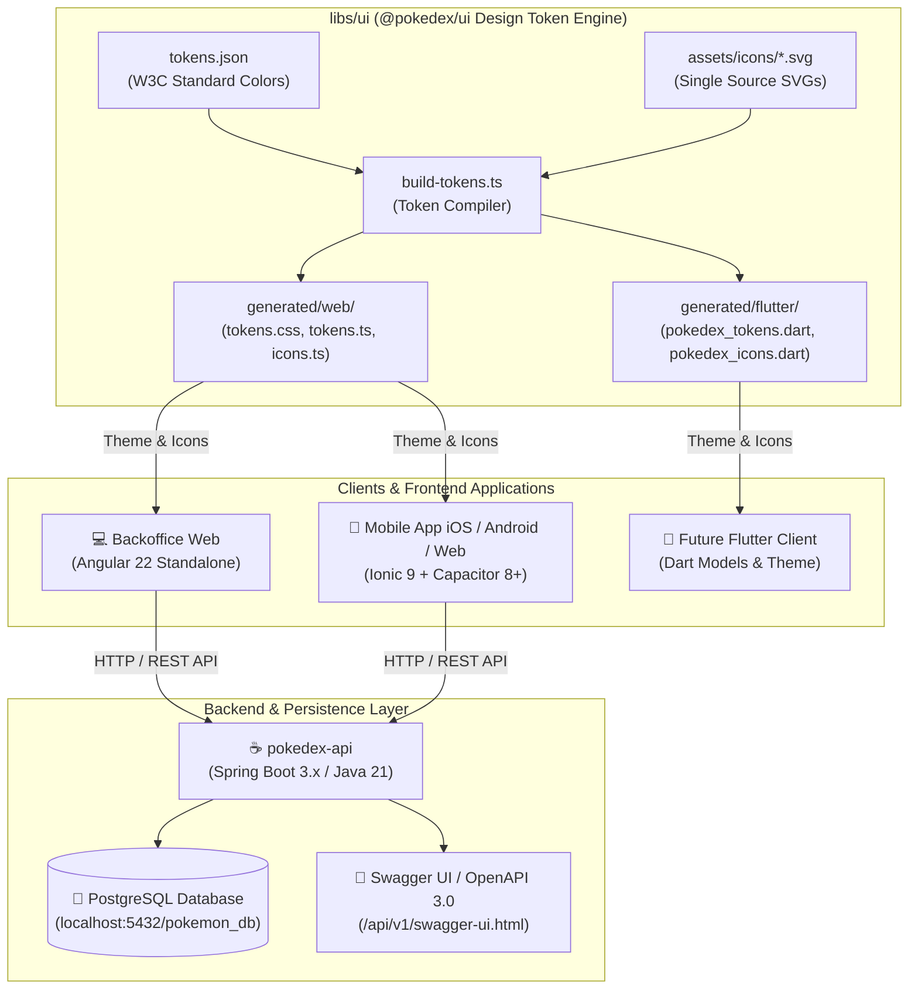

# 🌐 Pokédex System — Enterprise Monorepo

Enterprise-grade, multi-application monorepo powered by **Nx** and **pnpm workspaces**, architected around **Java 21 / Spring Boot 3.x**, **Angular 22** standalone components with Signal reactivity, **Ionic 9 / Capacitor 8+** for cross-platform mobile delivery, and a **Multiplatform Design Token Engine** (`@pokedex/ui`).

---

## 📖 Core Abstract & Functional Overview

The **Pokédex System** is an end-to-end digital ecosystem for Pokémon cataloging, administrative management, and multiplatform distribution. Built with a **Single Version Policy (SVP)**, the monorepo guarantees seamless version alignment, eliminates runtime dependency duplication, and enables maximum code and asset sharing across Web, iOS, Android, and Flutter.

### Feature & Workspace Matrix

| Workspace Target | Type | Primary Technology | Description | Status | Default Port / Target |
| :--- | :--- | :--- | :--- | :--- | :--- |
| **`pokedex-api`** | Backend API | Java 21 / Spring Boot 3.x / JPA | High-throughput REST API with PostgreSQL persistence, JPA queries, and Swagger OpenAPI documentation. | 🟢 Active | `http://localhost:8080/api/v1` |
| **`pokedex-backoffice`** | Web Application | Angular `v22.1.4` (Standalone) | Administrative dashboard for managing Pokémon data, icon galleries, and catalog metadata. | 🟢 Active | `http://localhost:4200` |
| **`pokedex-ionic`** | Mobile & Web App | Ionic 9 / Angular `v22.1.4` / Capacitor 8+ | Native cross-platform application for iOS, Android, and Web with local storage and fluid micro-interactions. | 🟢 Active | `http://localhost:8100` / iOS / Android |
| **`@pokedex/ui`** | Shared Design Core | TypeScript / CSS / Dart / W3C Tokens | Multiplatform design system compiling tokens and SVGs to Web (CSS/TS) and Flutter (Dart). | 🟢 Active | Subpath exports (`@pokedex/ui/*`) |
| **`.agents/`** | Architecture | Custom AI Rules & Skills | Enterprise engineering standards for Angular, Ionic, Spring Boot, Flutter, and Performance. | 🟢 Active | Monorepo Governance |

---

## 🚀 Architectural Runtime Flow



---

## 📁 Directory Tree

```text
pokedex-system/
├── .agents/                               # Enterprise Architecture protocols and AI Skills
│   ├── AGENTS.md                          # Master architectural protocol & coding standards
│   └── skills/                            # Domain-specific engineering skills
├── apps/
│   ├── pokedex-api/                       # Spring Boot 3.x / Java 21 REST API
│   │   ├── src/
│   │   │   └── main/
│   │   │       ├── java/com/dv/pokedex/   # Domain entities, repositories, and controllers
│   │   │       └── resources/             # application.properties & SQL migrations
│   │   ├── pom.xml                        # Maven dependency configuration
│   │   ├── mvnw                           # Maven wrapper
│   │   └── project.json                   # Nx project target definitions
│   ├── pokedex-backoffice/                # Standalone Angular 22 Backoffice Web Application
│   │   ├── src/
│   │   │   ├── app/
│   │   │   │   ├── features/pokedex/      # Feature-first catalog module with Signals
│   │   │   │   ├── shared/pipes/          # SafeHtmlPipe for trusted SVG rendering
│   │   │   │   ├── app.config.ts          # Angular providers & router configuration
│   │   │   │   └── app.routes.ts          # Lazy-loaded route definitions
│   │   │   ├── main.ts                    # Standalone bootstrapping entrypoint
│   │   │   └── styles.scss                # Global styles with @pokedex/ui imports
│   │   ├── angular.json                   # Angular workspace configuration
│   │   ├── project.json                   # Nx project target definitions
│   │   └── package.json                   # Backoffice workspace dependencies
│   └── pokedex-ionic/                     # Ionic 9 + Capacitor 8+ Cross-Platform Mobile App
│       ├── src/
│       │   ├── app/
│       │   │   ├── features/              # Feature modules (pokedex, favorites)
│       │   │   ├── shared/                # Layout, components, and storage service
│       │   │   ├── app.component.ts       # Root Ionic component
│       │   │   └── app.routes.ts          # Mobile navigation routes
│       │   ├── main.ts                    # Standalone bootstrap with Ionic & Router providers
│       │   ├── global.scss                # Global stylesheets with @pokedex/ui tokens
│       │   └── theme/                     # Ionic theme variables
│       ├── ios/                           # Capacitor iOS native project
│       ├── android/                       # Capacitor Android native project
│       ├── capacitor.config.ts            # Capacitor runtime configuration
│       ├── project.json                   # Nx project target definitions
│       └── package.json                   # Mobile-specific dependencies
├── libs/
│   └── ui/                                # Multiplatform Design Token Engine
│       ├── assets/
│       │   └── icons/                     # Clean, standalone SVG icons (Single Source of Truth)
│       ├── src/
│       │   ├── tokens.json                # Standard W3C color tokens
│       │   └── fonts.css                  # Typography CDN & font-family definitions
│       ├── scripts/
│       │   └── build-tokens.ts            # Cross-platform compiler (generates Web & Flutter outputs)
│       ├── generated/                     # Compiled outputs
│       │   ├── web/                       # tokens.css, tokens.ts, icons.ts (Angular, Ionic, React)
│       │   └── flutter/                   # pokedex_tokens.dart, pokedex_icons.dart (Flutter)
│       ├── package.json                   # Subpath exports definition
│       └── README.md                      # UI Library documentation & integration guide
├── docker-compose.yml                     # Local PostgreSQL and container definitions
├── nx.json                                # Nx build system and task graph caching
├── package.json                           # Monorepo root configuration (Single Version Policy)
├── pnpm-workspace.yaml                    # Workspace packages topology
└── tsconfig.base.json                     # Shared TypeScript compiler settings
```

---

## 🛠️ Technical Stack & Dependencies

### Monorepo Core Platform (Single Version Policy)

All shared web dependencies are hoisted and managed at the root [package.json](file:///Users/diegovilla/Desktop/pokedex-system/package.json) to eliminate dependency duplication across workspace applications:

| Dependency | Category | Exact Version | Purpose |
| :--- | :--- | :--- | :--- |
| **`nx`** | Build Orchestration | `23.1.2` | Smart monorepo task runner, computation caching, and project dependency graph |
| **`@angular/core`** | Frontend Framework | `^22.1.4` | Modern Angular with Signals, OnPush change detection, and Standalone components |
| **`@angular/common`** | Framework Utilities | `^22.1.4` | Core directives, pipes, and common browser abstractions |
| **`@angular/router`** | Routing Engine | `^22.1.4` | Component input binding and granular lazy-loading |
| **`@angular/forms`** | Forms Management | `^22.1.4` | Strictly typed reactive forms |
| **`@angular/platform-browser`** | Browser Platform | `^22.1.4` | DOM rendering and browser execution layer |
| **`@angular/cli` / `@angular/build`** | Build Engine | `^22.1.4` | Vite/esbuild application bundler and development server |
| **`rxjs`** | Reactive Streams | `~7.8.0` | Asynchronous stream processing and state orchestration |
| **`zone.js`** | Runtime Tracking | `~0.15.0` | Execution context tracking |
| **`typescript`** | Language | `~6.0.3` | Strict static typing and modern ECMAScript compilation |
| **`prettier`** | Code Quality | `^3.8.1` | Automated and unified code formatting |

### Backend API (`apps/pokedex-api`)
- **Java**: `21` (LTS)
- **Spring Boot**: `3.x` / `4.x`
- **Spring Data JPA**: PostgreSQL persistence and Specification queries
- **Springdoc OpenAPI**: Automated Swagger 3.0 UI generation
- **HikariCP**: High-performance database connection pooling

### Mobile & Hybrid Application (`apps/pokedex-ionic`)
- **Ionic Framework**: `@ionic/angular` `^9.0.0` (Standalone native Web Components)
- **Capacitor**: `@capacitor/core`, `@capacitor/ios`, `@capacitor/android` `^8.5.0`
- **Native Plugins**: `@capacitor/haptics`, `@capacitor/keyboard`, `@capacitor/status-bar`, `@capacitor/app`
- **Local Persistence**: `@ionic/storage-angular` `^4.0.0`

---

## ⚙️ Provisioning & Setup Guide

### Prerequisites
- **Node.js**: `>= 20.x` or `>= 22.x`
- **pnpm**: `>= 9.x` (`npm install -g pnpm`)
- **Java JDK**: `21` (for `pokedex-api`)
- **Docker**: For running PostgreSQL database container
- **Xcode** *(macOS)*: For running `pokedex-ionic` on iOS Simulator
- **Android Studio**: For running `pokedex-ionic` on Android Emulator

---

### 1. Repository Installation

```bash
# Clone the repository
git clone https://github.com/DiegoVilla27/pokedex-system.git
cd pokedex-system

# Install all workspace dependencies
pnpm install
```

---

### 2. Database Setup (Docker PostgreSQL)

Start the PostgreSQL database container:

```bash
# Start PostgreSQL on port 5432
docker compose up -d
```

Database connection parameters:
- **Host**: `localhost:5432`
- **Database**: `pokemon_db`
- **Username**: `pokemon_user`
- **Password**: `pokemon_pass`

---

### 3. Running Applications

You can start all applications simultaneously or target them individually:

```bash
# 🚀 Start all development servers simultaneously (API + Backoffice + Ionic)
pnpm dev

# ☕ Start only the Spring Boot Backend API
pnpm nx dev pokedex-api

# 💻 Start only the Angular Backoffice
pnpm nx dev pokedex-backoffice

# 📱 Start the Ionic Mobile App (iOS Live-Reload)
pnpm nx dev pokedex-ionic
```

---

### 4. Compiling Multiplatform Design Tokens (`@pokedex/ui`)

When modifying `tokens.json` or adding SVG icons to `libs/ui/assets/icons/`, recompile the tokens:

```bash
# Recompile design tokens to Web (CSS/TS) and Flutter (Dart)
pnpm --filter @pokedex/ui build
```

---

### 5. Build, Test & Maintenance Scripts

```bash
# Build all workspace applications for production
pnpm build

# Execute unit tests across the monorepo
pnpm test

# Visualize the interactive Nx Project Graph
pnpm graph

# Deep clean node_modules and local cache artifacts
pnpm clean
```

---

## 📈 Performance & Architecture Highlights

- **⚡ Single Version Policy (SVP)**: Guarantees zero duplicate Angular instances in memory, eliminating runtime dependency mismatch errors (`NG0203`).
- **🛡️ Signal-Driven Reactivity & OnPush**: Components utilize Angular Signals (`signal()`, `computed()`, `input()`) with `ChangeDetectionStrategy.OnPush` for optimal DOM reconciliation.
- **🎨 Multiplatform Token Engine**: Design tokens are authored in W3C JSON format and automatically compiled into type-safe constants for Web (`tokens.ts`, `tokens.css`) and Mobile (`pokedex_tokens.dart`).
- **📱 60fps Native Hybrid Delivery**: Ionic 9 standalone web components paired with Capacitor 8+ hardware-accelerated bridges for iOS and Android.
- **🚀 Nx Computation Caching**: Builds, tests, and lints are hashed and cached to ensure instant subsequent task execution.

---

> This digital ecosystem has been designed, structured, and developed to high-performance standards by **[Cabuweb](https://cabuweb.com)** - **Software Developer: Diego Villa**.
