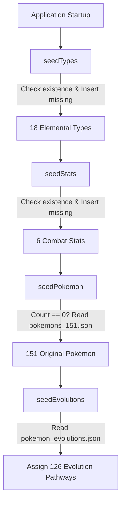

# 🔴 Pokédex REST API

[](https://openjdk.org/)
[](https://spring.io/projects/spring-boot)
[](https://www.postgresql.org/)
[](https://www.docker.com/)
[](https://swagger.io/specification/)
[](LICENSE)

A production-grade, enterprise-ready **Pokédex REST API** built with **Java 21**, **Spring Boot 4.1.1**, and **PostgreSQL**, designed following **Hexagonal / Clean Architecture** and **Domain-Driven Design (DDD)** principles.

---

## 📑 Table of Contents

- [Architectural Design](#-architectural-design)
- [Key Features](#-key-features)
- [Database Seeders & Auto-Initialization](#-database-seeders--auto-initialization)
- [Interactive API Documentation (Swagger UI)](#-interactive-api-documentation-swagger-ui)
- [REST API Endpoints Reference](#-rest-api-endpoints-reference)
  - [Pokémon Management](#1-pokémon-management)
  - [Pokémon Specialized Relations](#2-pokémon-specialized-relations)
  - [Elemental Types Catalog](#3-elemental-types-catalog)
  - [Combat Statistics Catalog](#4-combat-statistics-catalog)
- [Standardized Error Handling (RFC 7807)](#-standardized-error-handling-rfc-7807)
- [🐳 Docker & Containerization](#-docker--containerization)
- [Getting Started & Installation](#-getting-started--installation)
  - [Prerequisites](#prerequisites)
  - [Environment Configuration](#environment-configuration)
  - [Build and Run Locally](#build-and-run-locally)
- [Nx Monorepo Orchestration](#-nx-monorepo-orchestration)

---

## 🏛 Architectural Design

The project strictly adheres to **Hexagonal Architecture (Ports and Adapters)** to decouple business logic from infrastructure, web frameworks, and persistence details:

```
src/main/java/com/dv/pokedex/
├── core/
│   ├── exceptions/            # Global exception handlers & RFC 7807 problem details DTOs
│   ├── openapi/               # Swagger / OpenAPI custom configurations & reusable annotations
│   └── security/seeders/      # Database automated data initialization runners
├── features/
│   ├── pokemon/
│   │   ├── domain/            # Rich Domain Entities, Value Objects & Repository Ports
│   │   ├── application/       # Use Cases, Command records & Application Services
│   │   └── infrastructure/    # REST Controllers, JPA Entities, MapStruct Mappers & DTOs
│   ├── type/                  # Elemental Types module (Hexagonal layout)
│   └── stat/                  # Base Combat Stats module (Hexagonal layout)
└── utils/                     # Generic validation utilities
```

### Layer Responsibilities
* **Domain Layer**: Contains immutable Value Objects (`PokemonName`, `PokemonColor`, `PokemonStat`, `PokemonEvolution`, `TypeName`, `StatName`) and Domain Models with self-validating business rules.
* **Application Layer**: Defines input Ports, Command objects, and orchestration Services handling transactions and business workflows.
* **Infrastructure Layer**: Exposes REST endpoints with rich OpenAPI annotations, JPA persistence adapters, and MapStruct converters.

---

## ✨ Key Features

- **Full Pokémon Catalog Management**: Create, read, partially update (PATCH), and safely delete Pokémon profiles.
- **18 Elemental Types**: Full support for all standard Pokémon types (`grass`, `poison`, `fire`, `water`, `electric`, `dragon`, `dark`, `steel`, etc.).
- **6 Base Combat Statistics**: Tracking `hp`, `attack`, `defense`, `special-attack`, `special-defense`, and `speed`.
- **Multi-Stage & Branching Evolution Chains**: Support for linear (e.g., Bulbasaur → Ivysaur → Venusaur) and branching evolution pathways (e.g., Eevee → Vaporeon / Jolteon / Flareon).
- **Dynamic UI Card Colors**: RGB color models stored per Pokémon for customized frontend themes.
- **Rich Lore & Pokédex Descriptions**: High-quality descriptions up to 500 characters sourced from official Pokédex entries.

---

## 🌱 Database Seeders & Auto-Initialization

The application features an automated startup provisioning system orchestrated by [`DatabaseSeeder.java`](src/main/java/com/dv/pokedex/core/security/seeders/DatabaseSeeder.java) that executes upon application startup via Spring Boot's `CommandLineRunner`.

### Seeding Execution Pipeline



### 1. `seedTypes()`
* Automatically ensures all 18 Pokémon elemental types are present in the `types` database table.
* Evaluates `typeRepositoryPort.existsByName(typeName)` per item to guarantee idempotency.

### 2. `seedStats()`
* Automatically ensures all 6 standard combat stats (`hp`, `attack`, `defense`, `special-attack`, `special-defense`, `speed`) exist in the `stats` table.
* Verifies `statRepositoryPort.existsByName(statName)` to avoid duplicate inserts.

### 3. `seedPokemon()`
* Loads **151 Generation 1 Pokémon** from classpath resource [`src/main/resources/data/pokemons_151.json`](src/main/resources/data/pokemons_151.json).
* Validates and maps unique names, avatars, heights, weights, RGB theme colors, type foreign keys, and 6 base stat values.
* **Idempotency Guard**: Executes only if `pokemonRepositoryPort.count() == 0`.

### 4. `seedEvolutions()`
* Loads evolution progression lines from classpath resource [`src/main/resources/data/pokemon_evolutions.json`](src/main/resources/data/pokemon_evolutions.json).
* Assigns forward evolution relationships, sequence orders, and branching links to all 126 evolutionary Pokémon in Gen 1.

---

## 📖 Interactive API Documentation (Swagger UI)

Once the application is running, explore and test the entire API interactively using the built-in Swagger UI:

🔗 **Swagger UI Interface**:  
[`http://localhost:8080/api/v1/api-docs/swagger-ui.html`](http://localhost:8080/api/v1/api-docs/swagger-ui.html)

📄 **OpenAPI 3.0 Specification (JSON)**:  
[`http://localhost:8080/api/v1/api-docs`](http://localhost:8080/api/v1/api-docs)

---

## 🔌 REST API Endpoints Reference

> **Base URL Context Path**: `/api/v1`

### 1. Pokémon Management

| Method | Endpoint | Description | Status Code |
| :--- | :--- | :--- | :--- |
| `GET` | `/pokemons` | Retrieve a complete list of all registered Pokémon | `200 OK` |
| `GET` | `/pokemons/{id}` | Retrieve a single Pokémon profile by unique ID | `200 OK` / `404 Not Found` |
| `POST` | `/pokemons` | Create a new Pokémon profile with stats & types | `201 Created` / `400` / `409` |
| `PATCH` | `/pokemons/{id}` | Partially update Pokémon details (name, color, dimensions) | `200 OK` / `400` / `404` / `409` |
| `DELETE` | `/pokemons/{id}` | Delete a Pokémon and cascade related relations | `204 No Content` / `404 Not Found` |

---

### 2. Pokémon Specialized Relations

| Method | Endpoint | Description | Status Code |
| :--- | :--- | :--- | :--- |
| `PATCH` | `/pokemons/{pokemonId}/types` | Replace elemental types assigned to a Pokémon (1–2 types) | `204 No Content` / `400` / `404` |
| `PATCH` | `/pokemons/{pokemonId}/stats` | Replace combat stats assigned to a Pokémon | `204 No Content` / `400` / `404` |
| `PATCH` | `/pokemons/{pokemonId}/evolutions` | Assign forward evolution pathways and stages | `204 No Content` / `400` / `404` / `409` |

---

### 3. Elemental Types Catalog

| Method | Endpoint | Description | Status Code |
| :--- | :--- | :--- | :--- |
| `GET` | `/types` | Retrieve all registered Pokémon types | `200 OK` |
| `POST` | `/types` | Register a new unique elemental type | `201 Created` / `400` / `409` |
| `PATCH` | `/types/{id}` | Update an existing elemental type name | `200 OK` / `400` / `404` / `409` |
| `DELETE` | `/types/{id}` | Delete an elemental type from the system | `204 No Content` / `404 Not Found` |

---

### 4. Combat Statistics Catalog

| Method | Endpoint | Description | Status Code |
| :--- | :--- | :--- | :--- |
| `GET` | `/stats` | Retrieve all registered base combat statistics | `200 OK` |
| `POST` | `/stats` | Register a new combat statistic | `201 Created` / `400` / `409` |
| `PATCH` | `/stats/{id}` | Update an existing combat statistic name | `200 OK` / `400` / `404` / `409` |
| `DELETE` | `/stats/{id}` | Delete a combat statistic from the system | `204 No Content` / `404 Not Found` |

---

## 🛡 Standardized Error Handling (RFC 7807)

All API errors return a consistent, uniform problem details payload:

```json
{
  "timestamp": "2026-08-30T10:00:00Z",
  "status": 400,
  "error": "Bad Request",
  "message": "Validation failed for one or more fields",
  "errors": [
    {
      "field": "name",
      "value": "A",
      "message": "Name must be between 2 and 50 characters"
    }
  ]
}
```

---

## 🐳 Docker & Containerization

The backend API is containerized with a high-performance **Multi-Stage Dockerfile**:
- **Stage 1 (Build)**: `maven:3.9-eclipse-temurin-21-alpine` pre-caches dependencies via `mvn dependency:go-offline` and compiles the artifact.
- **Stage 2 (Runtime)**: `eclipse-temurin:21-jre-alpine` ultralight production image containing only the executable `app.jar`.

### Standalone Docker Build via Nx
```bash
pnpm nx docker-build pokedex-api
```

### Full Monorepo Compose Execution
```bash
# Starts API and Backoffice connected to external shared-network
pnpm docker:up
```

---

## 🚀 Getting Started & Installation

### Prerequisites
* **Java Development Kit (JDK)**: Version 21 (LTS)
* **Apache Maven**: Version 3.9+ (or use `./mvnw`)
* **PostgreSQL**: Version 16+ (or via Docker)

---

### Environment Configuration

The application reads database connection settings from `.env` in `apps/pokedex-api/.env` or system environment variables:

```properties
spring.application.name=pokedex
server.servlet.context-path=/api/v1
spring.datasource.url=${POSTGRES_URL:jdbc:postgresql://localhost:5432/pokemon_db}
spring.datasource.username=${POSTGRES_USER:pokemon_user}
spring.datasource.password=${POSTGRES_PASSWORD:pokemon_pass}
spring.jpa.hibernate.ddl-auto=update
```

---

### Build and Run Locally

```bash
# 1. Build and test with Maven wrapper
./mvnw clean package

# 2. Run Spring Boot application locally
./mvnw spring-boot:run

# 3. Or run through Nx task runner
pnpm nx dev pokedex-api
```

---

## ⚡ Nx Monorepo Orchestration

| Nx Target | Command | Purpose |
| :--- | :--- | :--- |
| `dev` | `pnpm nx dev pokedex-api` | Launches Spring Boot dev server locally |
| `build` | `pnpm nx build pokedex-api` | Compiles `.jar` artifact to `target/` with computation cache |
| `test` | `pnpm nx test pokedex-api` | Executes JUnit unit and integration tests |
| `docker-build` | `pnpm nx docker-build pokedex-api` | Builds production Docker image `pokedex-api:latest` |

---

## 📄 License

This project is licensed under the MIT License. See the [LICENSE](LICENSE) file for details.

---

> This digital ecosystem has been designed, structured, and developed to high-performance standards by **[Cabuweb](https://cabuweb.com)** - **Software Developer: Diego Villa**.
