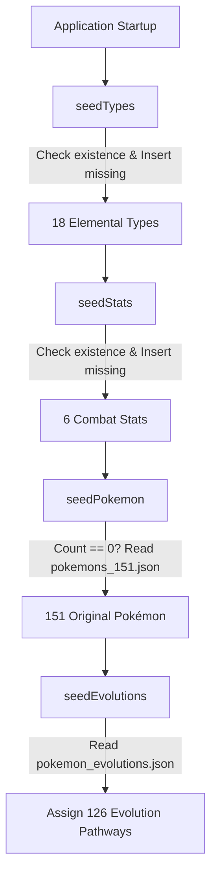

# 🔴 Pokédex REST API

[](https://openjdk.org/)
[](https://spring.io/projects/spring-boot)
[](https://www.postgresql.org/)
[](https://swagger.io/specification/)
[](LICENSE)

A production-grade, enterprise-ready **Pokédex REST API** built with **Java 17**, **Spring Boot 4.1.1**, and **PostgreSQL**, designed following **Hexagonal / Clean Architecture** and **Domain-Driven Design (DDD)** principles.

---

## 📑 Table of Contents

- [Architectural Design](#-architectural-design)
- [Key Features](#-key-features)
- [Database Seeders & Auto-Initialization](#-database-seeders--auto-initialization)
- [Interactive API Documentation (Swagger UI)](#-interactive-api-documentation-swagger-ui)
- [REST API Endpoints Reference](#-rest-api-endpoints-reference)
  - [Pokémon Management](#1-pokémon-management)
  - [Pokémon Specialized Relations](#2-pokémon-specialized-relations)
  - [Elemental Types Catalog](#3-elemental-types-catalog)
  - [Combat Statistics Catalog](#4-combat-statistics-catalog)
- [Standardized Error Handling (RFC 7807)](#-standardized-error-handling-rfc-7807)
- [Getting Started & Installation](#-getting-started--installation)
  - [Prerequisites](#prerequisites)
  - [Environment Configuration](#environment-configuration)
  - [Docker Setup (PostgreSQL)](#docker-setup-postgresql)
  - [Build and Run Locally](#build-and-run-locally)

---

## 🏛 Architectural Design

The project strictly adheres to **Hexagonal Architecture (Ports and Adapters)** to decouple business logic from infrastructure, web frameworks, and persistence details:

```
src/main/java/com/dv/pokedex/
├── core/
│   ├── exceptions/            # Global exception handlers & RFC 7807 problem details DTOs
│   ├── openapi/               # Swagger / OpenAPI custom configurations & reusable annotations
│   └── security/seeders/      # Database automated data initialization runners
├── features/
│   ├── pokemon/
│   │   ├── domain/            # Rich Domain Entities, Value Objects & Repository Ports
│   │   ├── application/       # Use Cases, Command records & Application Services
│   │   └── infrastructure/    # REST Controllers, JPA Entities, MapStruct Mappers & DTOs
│   ├── type/                  # Elemental Types module (Hexagonal layout)
│   └── stat/                  # Base Combat Stats module (Hexagonal layout)
└── utils/                     # Generic validation utilities
```

### Layer Responsibilities
* **Domain Layer**: Contains immutable Value Objects (`PokemonName`, `PokemonColor`, `PokemonStat`, `PokemonEvolution`, `TypeName`, `StatName`) and Domain Models with self-validating business rules.
* **Application Layer**: Defines input Ports, Command objects, and orchestration Services handling transactions and business workflows.
* **Infrastructure Layer**: Exposes REST endpoints with rich OpenAPI annotations, JPA persistence adapters, and MapStruct converters.

---

## ✨ Key Features

- **Full Pokémon Catalog Management**: Create, read, partially update (PATCH), and safely delete Pokémon profiles.
- **18 Elemental Types**: Full support for all standard Pokémon types (`grass`, `poison`, `fire`, `water`, `electric`, `dragon`, `dark`, `steel`, etc.).
- **6 Base Combat Statistics**: Tracking `hp`, `attack`, `defense`, `special-attack`, `special-defense`, and `speed`.
- **Multi-Stage & Branching Evolution Chains**: Support for linear (e.g., Bulbasaur → Ivysaur → Venusaur) and branching evolution pathways (e.g., Eevee → Vaporeon / Jolteon / Flareon).
- **Dynamic UI Card Colors**: RGB color models stored per Pokémon for customized frontend themes.
- **Rich Lore & Pokédex Descriptions**: High-quality descriptions up to 500 characters sourced from official Pokédex entries.

---

## 🌱 Database Seeders & Auto-Initialization

The application features an automated startup provisioning system orchestrated by [`DatabaseSeeder.java`](src/main/java/com/dv/pokedex/core/security/seeders/DatabaseSeeder.java) that executes upon application startup via Spring Boot's `CommandLineRunner`.

### Seeding Execution Pipeline



### 1. `seedTypes()`
* Automatically ensures all 18 Pokémon elemental types are present in the `types` database table.
* Evaluates `typeRepositoryPort.existsByName(typeName)` per item to guarantee idempotency.

### 2. `seedStats()`
* Automatically ensures all 6 standard combat stats (`hp`, `attack`, `defense`, `special-attack`, `special-defense`, `speed`) exist in the `stats` table.
* Verifies `statRepositoryPort.existsByName(statName)` to avoid duplicate inserts.

### 3. `seedPokemon()`
* Loads **151 Generation 1 Pokémon** from classpath resource [`src/main/resources/data/pokemons_151.json`](src/main/resources/data/pokemons_151.json).
* Validates and maps:
  - Unique name and official artwork avatar URL.
  - Height (meters) and Weight (kilograms).
  - Primary UI theme RGB color.
  - Assigned elemental type foreign keys.
  - 6 initial base stat values (1–255).
* **Idempotency Guard**: Executes only if `pokemonRepositoryPort.count() == 0`, preventing re-seeding on subsequent application restarts.

### 4. `seedEvolutions()`
* Loads evolution progression lines from classpath resource [`src/main/resources/data/pokemon_evolutions.json`](src/main/resources/data/pokemon_evolutions.json).
* Assigns forward evolution relationships, sequence orders, and branching links to all 126 evolutionary Pokémon in Gen 1.

---

## 📖 Interactive API Documentation (Swagger UI)

Once the application is running, explore and test the entire API interactively using the built-in Swagger UI:

🔗 **Swagger UI Interface**:  
[`http://localhost:8080/api/v1/api-docs/swagger-ui.html`](http://localhost:8080/api/v1/api-docs/swagger-ui.html)

📄 **OpenAPI 3.0 Specification (JSON)**:  
[`http://localhost:8080/api/v1/api-docs`](http://localhost:8080/api/v1/api-docs)

---

## 🔌 REST API Endpoints Reference

> **Base URL Context Path**: `/api/v1`

### 1. Pokémon Management

| Method | Endpoint | Description | Status Code |
| :--- | :--- | :--- | :--- |
| `GET` | `/pokemons` | Retrieve a complete list of all registered Pokémon | `200 OK` |
| `GET` | `/pokemons/{id}` | Retrieve a single Pokémon profile by unique ID | `200 OK` / `404 Not Found` |
| `POST` | `/pokemons` | Create a new Pokémon profile with stats & types | `201 Created` / `400` / `409` |
| `PATCH` | `/pokemons/{id}` | Partially update Pokémon details (name, color, dimensions) | `200 OK` / `400` / `404` / `409` |
| `DELETE` | `/pokemons/{id}` | Delete a Pokémon and cascade related relations | `204 No Content` / `404 Not Found` |

#### Example: Create Pokémon (`POST /pokemons`)
```json
{
  "name": "Pikachu",
  "description": "When several of these Pokémon gather, their electricity could build and cause lightning storms.",
  "avatar": "https://raw.githubusercontent.com/PokeAPI/sprites/master/sprites/pokemon/other/official-artwork/25.png",
  "height": 0.4,
  "weight": 6.0,
  "color": {
    "r": 255,
    "g": 204,
    "b": 0
  },
  "typeIds": [8],
  "stats": [
    { "statId": 1, "value": 35 },
    { "statId": 2, "value": 55 },
    { "statId": 3, "value": 40 },
    { "statId": 4, "value": 50 },
    { "statId": 5, "value": 50 },
    { "statId": 6, "value": 90 }
  ]
}
```

---

### 2. Pokémon Specialized Relations

| Method | Endpoint | Description | Status Code |
| :--- | :--- | :--- | :--- |
| `PATCH` | `/pokemons/{pokemonId}/types` | Replace elemental types assigned to a Pokémon (1–2 types) | `204 No Content` / `400` / `404` |
| `PATCH` | `/pokemons/{pokemonId}/stats` | Replace combat stats assigned to a Pokémon | `204 No Content` / `400` / `404` |
| `PATCH` | `/pokemons/{pokemonId}/evolutions` | Assign forward evolution pathways and stages | `204 No Content` / `400` / `404` / `409` |

#### Example: Assign Evolution Chain (`PATCH /pokemons/1/evolutions`)
```json
{
  "evolutions": [
    { "toPokemonId": 1, "order": 1 },
    { "toPokemonId": 2, "order": 2 },
    { "toPokemonId": 3, "order": 3 }
  ]
}
```

---

### 3. Elemental Types Catalog

| Method | Endpoint | Description | Status Code |
| :--- | :--- | :--- | :--- |
| `GET` | `/types` | Retrieve all registered Pokémon types | `200 OK` |
| `POST` | `/types` | Register a new unique elemental type | `201 Created` / `400` / `409` |
| `PATCH` | `/types/{id}` | Update an existing elemental type name | `200 OK` / `400` / `404` / `409` |
| `DELETE` | `/types/{id}` | Delete an elemental type from the system | `204 No Content` / `404 Not Found` |

---

### 4. Combat Statistics Catalog

| Method | Endpoint | Description | Status Code |
| :--- | :--- | :--- | :--- |
| `GET` | `/stats` | Retrieve all registered base combat statistics | `200 OK` |
| `POST` | `/stats` | Register a new combat statistic | `201 Created` / `400` / `409` |
| `PATCH` | `/stats/{id}` | Update an existing combat statistic name | `200 OK` / `400` / `404` / `409` |
| `DELETE` | `/stats/{id}` | Delete a combat statistic from the system | `204 No Content` / `404 Not Found` |

---

## 🛡 Standardized Error Handling (RFC 7807)

All API errors return a consistent, uniform problem details payload:

```json
{
  "timestamp": "2026-08-30T10:00:00Z",
  "status": 400,
  "error": "Bad Request",
  "message": "Validation failed for one or more fields",
  "errors": [
    {
      "field": "name",
      "value": "A",
      "message": "Name must be between 2 and 50 characters"
    }
  ]
}
```

| HTTP Status | Reason | Trigger Example |
| :--- | :--- | :--- |
| `400 Bad Request` | Validation Failure | Missing required fields, invalid stat values (not 1–255), blank names |
| `404 Not Found` | Resource Missing | Requesting a non-existent Pokémon, Type, or Stat ID |
| `409 Conflict` | Unique Violation | Registering an existing Pokémon name or duplicate Type name |
| `500 Server Error`| Internal Failure | Unexpected database or system exceptions |

---

## 🚀 Getting Started & Installation

### Prerequisites
* **Java Development Kit (JDK)**: Version 17 or higher
* **Apache Maven**: Version 3.8+ (or use the included `./mvnw` wrapper)
* **PostgreSQL**: Version 15+ (or Docker)

---

### Environment Configuration

The application reads database connection settings from system environment variables or a local `.env` file in the root directory:

1. Create a `.env` file in the project root:
   ```env
   POSTGRES_URL=jdbc:postgresql://localhost:5432/pokedex
   ```

2. Configuration variables in `src/main/resources/application.properties`:
   ```properties
   spring.application.name=pokedex
   server.servlet.context-path=/api/v1
   spring.datasource.url=${POSTGRES_URL}
   spring.datasource.username=user
   spring.datasource.password=password
   spring.jpa.hibernate.ddl-auto=update
   ```

---

### Docker Setup (PostgreSQL)

To quickly spin up a PostgreSQL instance using Docker Compose:

1. Create a `docker-compose.yml` file in the root directory:
   ```yaml
   services:
     postgres:
       image: postgres:16-alpine
       container_name: pokedex-postgres
       restart: always
       environment:
         POSTGRES_DB: pokedex
         POSTGRES_USER: user
         POSTGRES_PASSWORD: password
       ports:
         - "5432:5432"
       volumes:
         - postgres_data:/var/lib/postgresql/data

   volumes:
     postgres_data:
   ```

2. Start the database container:
   ```bash
   docker compose up -d
   ```

---

### Build and Run Locally

1. **Clone the repository**:
   ```bash
   git clone https://github.com/your-username/pokedex.git
   cd pokedex
   ```

2. **Build and test the project**:
   ```bash
   ./mvnw clean package
   ```

3. **Run the Spring Boot application**:
   ```bash
   ./mvnw spring-boot:run
   ```

4. **Verify Application Startup**:
   Open your browser and navigate to the Swagger UI:  
   👉 **`http://localhost:8080/api/v1/api-docs/swagger-ui.html`**

---

## 📄 License

This project is licensed under the MIT License. See the [LICENSE](LICENSE) file for details.

---

> This digital ecosystem has been designed, structured, and developed to high-performance standards by **[Cabuweb](https://cabuweb.com)** - **Software Developer: Diego Villa**.
