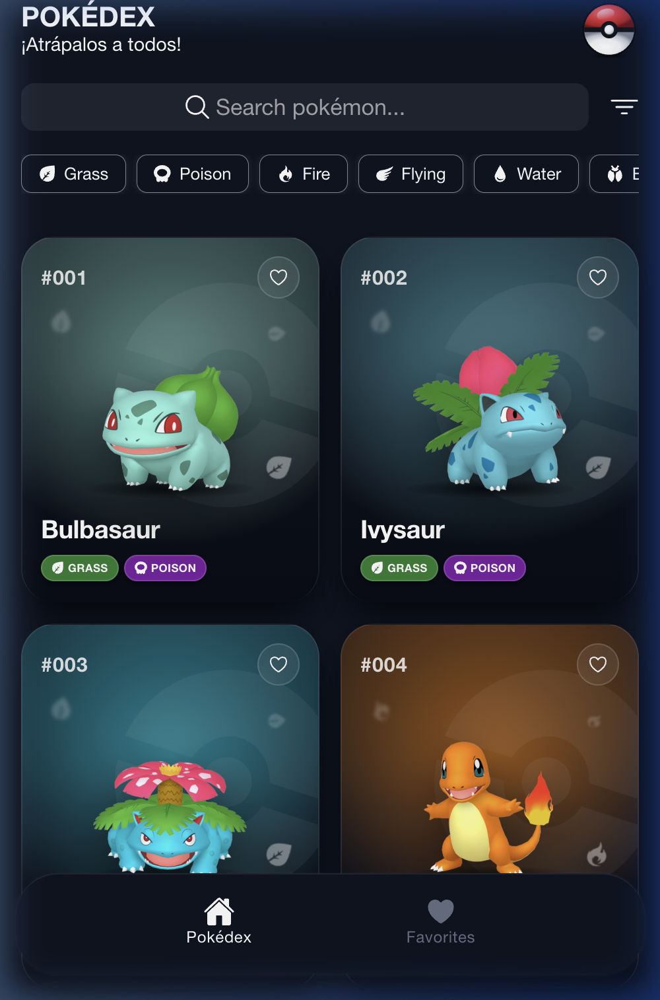
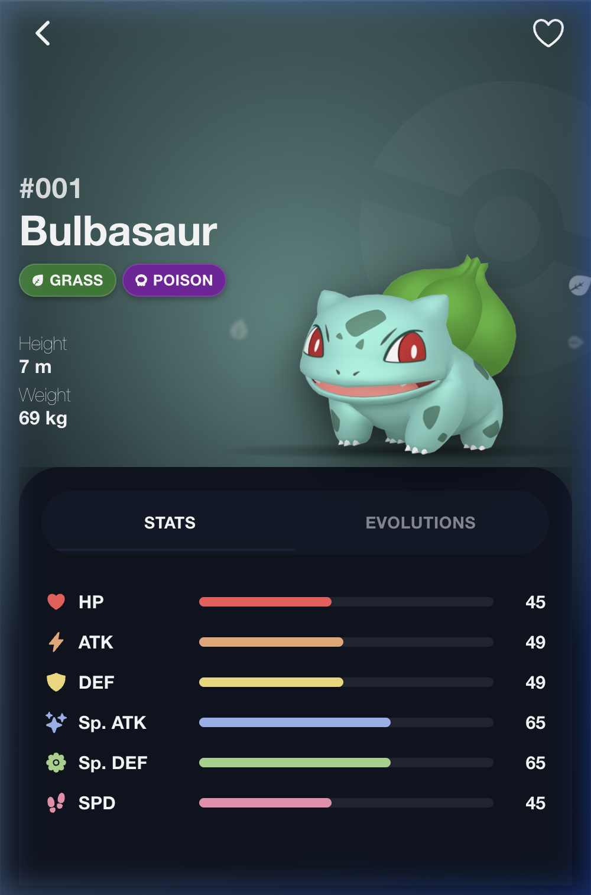
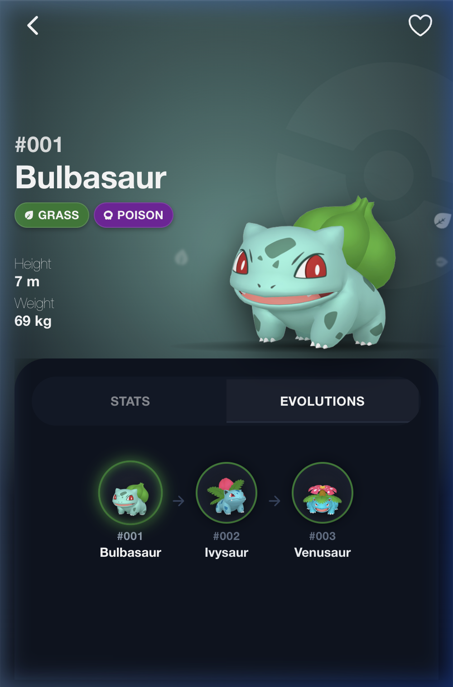
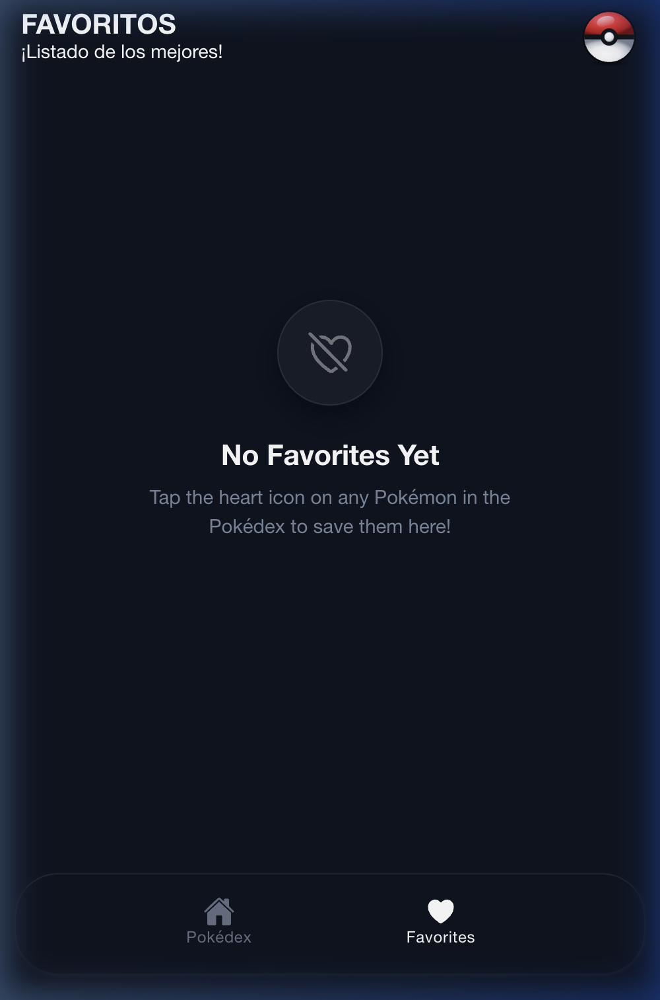

# 📱 Pokédex Mobile App

A modern, responsive, and high-performance Pokédex mobile application built with **Ionic 9**, **Angular 22** (Signals & Standalone Components), and **Capacitor 8** for iOS and Android.

---

## 🚀 Core Technologies

- **Framework:** [Angular 22](https://angular.dev/) (Standalone Components, Signals & Control Flow `@if/@for`)
- **UI & Mobile Components:** [Ionic 9](https://ionicframework.com/)
- **Native Runtime:** [Capacitor 8](https://capacitorjs.com/) (iOS & Android)
- **Local Persistence:** `@ionic/storage-angular` (IndexedDB / SQLite)
- **Icons & Styling:** Ionicons & modern SCSS with glassmorphism and responsive layout

---

## ✨ Key Features

- ⚡ **Pokémon Exploration:** Interactive grid featuring infinite scroll and smooth on-demand pagination.
- 🔍 **Search & Filtering:** Real-time search by Pokémon name and dynamic filtering by elemental types.
- 📊 **Pokémon Detail View:**
  - Animated base stats visualizer with color-coded progress bars.
  - Dynamic evolution tree: linear layout for standard chains (≤ 3 forms) and branched tree layout for multi-evolution Pokémon such as Eevee (8 forms).
- ❤️ **Favorites Module:** Reactive favorites system persisted in local storage with instant synchronization across the Pokédex grid and detail pages.

---

## 📸 Screenshots

|                                 Pokédex (Grid)                                 |                                     Detail (Stats)                                      |                                        Detail (Evolutions)                                        |                                   Favorites                                    |
| :----------------------------------------------------------------------------: | :-------------------------------------------------------------------------------------: | :-----------------------------------------------------------------------------------------------: | :----------------------------------------------------------------------------: |
|  |  |  |  |

---

## 📋 Prerequisites

Ensure you have the following installed in your development environment:

- **Node.js:** v18.x or higher
- **Package Manager:** `pnpm` (`npm install -g pnpm`)
- **Ionic CLI:** (`npm install -g @ionic/cli`)
- **For iOS:** macOS with Xcode 15+ and CocoaPods installed.
- **For Android:** Android Studio with configured Android SDK.

---

## 🛠️ Web Installation & Quickstart

### 1. Clone the repository and install dependencies:

```bash
git clone <repository-url>
cd pokedex-ionic
pnpm install
```

### 2. Start the local development server:

```bash
ionic serve
# or alternatively:
pnpm start
```

The application will be available at `http://localhost:8100/`.

---

# START PROJECT & NATIVE PLATFORMS

To deploy and test the application on native devices or emulators (iOS and Android), follow this 4-step workflow:

1. **Install device libraries**
2. **Create native projects**
3. **Build the web assets (`ionic build`)**
4. **Synchronize native projects (`npx cap sync`)**

---

# DEVICES

To run on native devices, install Capacitor platform libraries and generate the respective projects:

## 🍎 iOS

```bash
# 1. Install Capacitor iOS library
pnpm add @capacitor/ios

# 2. Add native iOS project in /ios
npx cap add ios

# 3. Build frontend and sync assets
ionic build
npx cap sync ios

# 4. Open project in Xcode
npx cap open ios

# 5. Run with Live Reload on emulator or physical device
ionic capacitor run ios -l --external
# (or via npm script)
pnpm dev:ios
```

### List available iOS simulator devices with their IDs:

```bash
xcrun simctl list devices available
```

---

## 🤖 Android

```bash
# 1. Install Capacitor Android library
pnpm add @capacitor/android

# 2. Add native Android project in /android
npx cap add android

# 3. Build frontend and sync assets
ionic build
npx cap sync android

# 4. Open project in Android Studio
npx cap open android

# 5. Run with Live Reload on emulator or physical device
ionic capacitor run android -l --external
# (or via npm script)
pnpm dev:android
```

### List connected Android devices with their IDs:

```bash
adb devices
```

---

## 🔄 Build & Synchronization Workflow

Whenever you modify Angular code and want to push updates to native platforms without Live Reload:

### 1. Build the frontend:

```bash
ionic build
# or:
pnpm build
```

### 2. Copy compiled assets to native directories:

```bash
npx cap sync
```

---

## 📜 Available NPM Scripts

| Command            | Description                                                                        |
| :----------------- | :--------------------------------------------------------------------------------- |
| `pnpm dev`         | Starts local web dev server (`ng serve`)                                           |
| `pnpm dev:ios`     | Runs app on iOS with Live Reload (`ionic capacitor run ios -l --external`)         |
| `pnpm dev:android` | Runs app on Android with Live Reload (`ionic capacitor run android -l --external`) |
| `pnpm build`       | Compiles production web bundle to `/www`                                           |
| `pnpm test`        | Runs unit test suite with Vitest                                                   |
| `pnpm lint`        | Runs ESLint code analysis                                                          |

---

## 📂 Project Structure

```text
src/
├── app/
│   ├── app.component.ts        # Root application component
│   ├── app.routes.ts           # Route definitions and layout shell
│   ├── features/
│   │   ├── pokedex/            # Pokédex module (grid, cards, detail, stats & evolutions)
│   │   └── favorites/          # Favorites module (reactive service & favorites view)
│   └── shared/
│       ├── layout/             # Header, Navigation Tab Bar & Drawer components
│       ├── services/           # StorageService and core shared utilities
│       └── utils/              # Type colors, icons, and stat configurations
├── assets/                     # Pokémon type SVGs, Pokéball vectors, and graphical assets
└── global.scss                 # Global stylesheets and design tokens
```

---

> This digital ecosystem has been designed, structured, and developed to high-performance standards by **[Cabuweb](https://cabuweb.com)** - **Software Developer: Diego Villa**.
