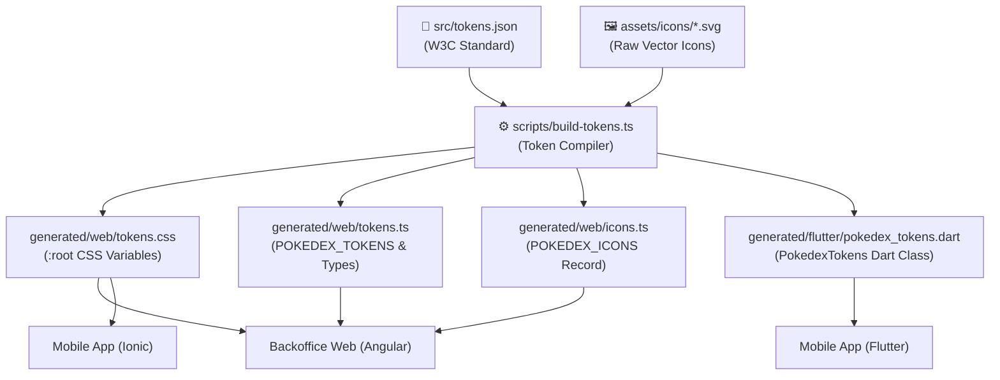

# 🎨 Multiplatform Design Token & Icon Engine (`@pokedex/ui`)

[](https://www.typescriptlang.org/)
[](https://flutter.dev)
[](https://www.w3.org/Style/CSS/)
[](LICENSE)

A unified, multiplatform design token and SVG asset compiler that serves as the **Single Source of Truth** for color tokens, typography, and vector icons across **Web (Angular & Ionic)** and **Mobile (Flutter)** in the Pokédex monorepo.

---

## 📑 Table of Contents

- [Architectural Philosophy](#-architectural-philosophy)
- [Single Source of Truth (SSOT)](#-single-source-of-truth-ssot)
  - [1. Color Tokens (`src/tokens.json`)](#1-color-tokens-srctokensjson)
  - [2. SVG Icon Library (`assets/icons/`)](#2-svg-icon-library-assetsicons)
- [⚙️ Multiplatform Token Compiler (`build-tokens.ts`)](#️-multiplatform-token-compiler-build-tokensts)
- [📦 Compiled Artifacts & Subpath Exports](#-compiled-artifacts--subpath-exports)
  - [Web Outputs (CSS & TypeScript)](#web-outputs-css--typescript)
  - [Flutter Output (Dart)](#flutter-output-dart)
- [🚀 How to Build & Recompile Tokens](#-how-to-build--recompile-tokens)
- [💡 Integration Examples](#-integration-examples)
  - [Angular / Web Component Integration](#angular--web-component-integration)
  - [Flutter Widget Integration](#flutter-widget-integration)
- [📁 Directory Tree](#-directory-tree)

---

## 🏛️ Architectural Philosophy

In a multi-platform monorepo containing Angular, Ionic, and Flutter clients, duplicating color palettes, theme values, or SVG definitions across multiple repositories leads to drift, rendering discrepancies, and heavy maintenance burdens.

`@pokedex/ui` solves this by decoupling design tokens and asset definitions from client frameworks:
1. **Tokens** are authored once in standard W3C JSON.
2. **Icons** are authored once as clean, standalone `.svg` vectors.
3. **The compiler** (`build-tokens.ts`) transforms these definitions into native formats for Web and Mobile.



---

## 💎 Single Source of Truth (SSOT)

### 1. Color Tokens (`src/tokens.json`)
Adheres to the W3C Design Tokens Community Group specification. Groups colors into logical domains:
- **`background`**: Surface and container colors (`primary`, `surface`, `card`, `glass`).
- **`text`**: High-contrast typography colors (`primary`, `secondary`, `muted`).
- **`border`**: Outline and divider strokes (`subtle`, `focus`, `accent`).
- **`stats`**: Pokémon combat statistic colors (`hp`, `attack`, `defense`, `specialAttack`, `specialDefense`, `speed`).
- **`types`**: 18 official elemental type colors (`fire`, `water`, `grass`, `electric`, `dragon`, etc.).

### 2. SVG Icon Library (`assets/icons/`)
Self-contained, viewBox-scaled vector icons including Pokémon types, Pokéballs, battle stats, navigation icons, and UI actions.

---

## ⚙️ Multiplatform Token Compiler (`build-tokens.ts`)

The compiler script (`scripts/build-tokens.ts`) performs the following automated pipelines:
1. **Hex to Native Conversion**: Converts standard 6-digit (`#RRGGBB`) and 8-digit (`#RRGGBBAA`) hex strings into Flutter `Color(0xAARRGGBB)` format and CSS variables.
2. **CSS Variable Generation**: Generates `:root` variables prefixed with `--pk-color-`.
3. **Type-Safe TypeScript Generation**: Emits strongly typed objects and literal union types (`PokemonType`, `PokemonStat`, `PokemonBackground`, `PokemonBorder`, `PokemonText`).
4. **SVG Inlining**: Reads raw SVG files, sanitizes whitespace, and builds an inlined, typed dictionary (`POKEDEX_ICONS`).
5. **Flutter Dart Class Generation**: Emits an abstract `PokedexTokens` class with static `Color` constants.

---

## 📦 Compiled Artifacts & Subpath Exports

The library exposes package exports configured in `package.json`:

```json
{
  "exports": {
    "./tokens.json": "./src/tokens.json",
    "./fonts.css": "./src/fonts.css",
    "./icons/*": "./assets/icons/*",
    "./tokens.css": "./generated/web/tokens.css",
    "./tokens": "./generated/web/tokens.ts",
    "./icons": "./generated/web/icons.ts",
    "./flutter/*": "./generated/flutter/*"
  }
}
```

### Web Outputs (CSS & TypeScript)
- **`@pokedex/ui/tokens.css`**: Ready-to-use CSS Custom Properties.
- **`@pokedex/ui/tokens`**: TypeScript constant `POKEDEX_TOKENS` and domain types.
- **`@pokedex/ui/icons`**: TypeScript constant `POKEDEX_ICONS` containing all SVG vectors.
- **`@pokedex/ui/fonts.css`**: Global font CDN linkages (`Outfit` and `Inter`).

### Flutter Output (Dart)
- **`@pokedex/ui/flutter/pokedex_tokens.dart`**: Strongly typed Flutter `Color` constants.

---

## 🚀 How to Build & Recompile Tokens

Whenever you update `src/tokens.json` or add/edit an SVG in `assets/icons/`, execute:

```bash
# From the repository root:
pnpm --filter @pokedex/ui build

# Or directly in libs/ui:
cd libs/ui
pnpm build
```

---

## 💡 Integration Examples

### Angular / Web Component Integration

#### 1. Import styles in `styles.scss` or `global.scss`:
```scss
@import "@pokedex/ui/fonts.css";
@import "@pokedex/ui/tokens.css";

.pokemon-card-fire {
  background-color: var(--pk-color-types-fire);
  color: var(--pk-color-text-primary);
}
```

#### 2. Render typed SVG icons in Angular:
```typescript
import { Component } from '@angular/core';
import { POKEDEX_ICONS } from '@pokedex/ui/icons';

@Component({
  standalone: true,
  template: `<div [innerHTML]="fireIcon"></div>`
})
export class TypeBadgeComponent {
  readonly fireIcon = POKEDEX_ICONS['fire'];
}
```

---

### Flutter Widget Integration

```dart
import 'package:flutter/material.dart';
import '../../../../libs/ui/generated/flutter/pokedex_tokens.dart';

Widget buildTypeBadge() {
  return Container(
    padding: const EdgeInsets.symmetric(horizontal: 12, vertical: 6),
    decoration: BoxDecoration(
      color: PokedexTokens.typeFire,
      borderRadius: BorderRadius.circular(16),
    ),
    child: const Text(
      'FIRE',
      style: TextStyle(color: PokedexTokens.textPrimary),
    ),
  );
}
```

---

## 📁 Directory Tree

```text
libs/ui/
├── assets/
│   └── icons/               # Single source of truth SVG icons
├── src/
│   ├── tokens.json          # W3C standard JSON color tokens
│   └── fonts.css            # Typography and web fonts definitions
├── scripts/
│   └── build-tokens.ts      # Multiplatform compiler (TSX runner)
├── generated/
│   ├── web/
│   │   ├── tokens.css       # Compiled CSS custom properties
│   │   ├── tokens.ts        # Typed TypeScript constants & union types
│   │   └── icons.ts         # SVG dictionary constant
│   └── flutter/
│       └── pokedex_tokens.dart # Compiled Flutter Dart color constants
├── package.json             # Subpath exports definition
└── README.md                # Library documentation
```

---

> This digital ecosystem has been designed, structured, and developed to high-performance standards by **[Cabuweb](https://cabuweb.com)** - **Software Developer: Diego Villa**.
